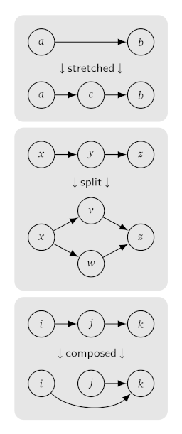
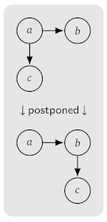

# `cru` -- co-recursion utilities

`Cru` is a C library for *high-performance*, *high-level* operations
on memory-resident graphs, typically on the order of millions to tens
of millions of vertices, with possible applications to model checking,
finite element analysis, and financial derivatives valuation among
other things. It's your choice to opt for graph vertices and edge
labels that are scalar values or pointers to application-specific data
types.

* `Cru` is *high-level* in that it works by calling functions written
   by you in "think-like-a-vertex"[^1] style. For example, if one step of
   your algorithm were to entail filtering or selectively deleting
   some of the vertices from a graph, you would write a function that
   takes a vertex as an argument and returns zero or one depending on
   whether you want that vertex deleted or kept. `Cru` would apply
   your function to every vertex in the graph and delete only the
   indicated vertices. It would handle all of the necessary memory
   management and keep the graph consistent by also deleting any
   incoming or outgoing edges formerly connected to deleted
   vertices. If any vertices were to become consequently unreachable,
   `cru` would delete those too and all of the edges touching them.

* `Cru` is *high-performance* because it does all that concurrently by
   running the number of threads you request, distributing the work
   evenly over that number of cores if available, and invisibly
   handling all necessary locking and synchronization. `Cru` uses the
   [Judy array](https://sourceforge.net/projects/judy) library for
   many of its internal performance critical operations such as
   key-value storage, which is a [very
   mature](https://en.wikipedia.org/wiki/Judy_array) and stable
   project that's probably in your distro's standard package
   repository. `Cru` also links with any of three state-of-the-art
   memory allocators, either
   [tcmalloc](https://github.com/google/tcmalloc),
   [mimalloc](https://github.com/microsoft/mimalloc), or
   [jemalloc](https://github.com/jemalloc/jemalloc), if detected
   during installation.

## Co-recursion

To build a graph with `cru`, you provide an initial vertex and a rule
for generating adjacent vertices as a function (written in C) of an
arbitrary given vertex. `Cru` then iterates this rule starting from
the initial vertex until all reachable vertices are found. This
procedure sometimes goes by the *ad hoc* name of co-recursion, as in
the "complement" of recursion, because it starts small and works its
way up instead of the other way around. Here are some examples of
problems that naturally lend themselves to co-recursion.

* generating all possible positions of a board game through the
  next $n$ moves
* generating all words up to a fixed length from an ambiguous grammar 
* generating all reachable markings of a Petri net starting from an
  initial marking
* generating all state-price points of the type of lattice model used
  in financial derivatives valuation
* generating all equivalent forms of an algebraic expression up to
  the limit of some cost metric

While these problems may appear readily amenable to concurrent
algorithms, a naive thread-pool based attempt leads to an immediate
difficulty. If you try to generate the first ten instances
sequentially and then hand off each of those to a worker thread to
generate the rest from there, multiple workers will probably generate
the same instance eventually and thereafter duplicate one another's
work to the point of blunting any speedup gained from concurrency. The
more workers there are, the higher the probability is.

The knee-jerk remedy of dedicating an extra worker to enforce
uniqueness on a global queue of work packets is no better. The extra
worker becomes a bottleneck and the rest of the workers spend more time
queueing than doing useful work, especially if the amount of work per
packet is small and the number of workers is large.

`Cru` takes a different approach by having the workers interact as
peers following a scatter-gather protocol. Each packet has a hash
value and each worker is responsible only for packets whose hashes
fall within a designated range known to all workers. If a worker
creates any packets outside of its own hash range, it dispatches them
directly to the co-workers responsible for them. The bottleneck is
eliminated because all workers concurrently check their incoming
packets for duplicates, which are detectable quickly using Judy
arrays.

## Example

This short but complete example creates a graph in the shape of an
eight-dimensional hypercube with numeric vertices and edge labels.

```c
#include <stdio.h>
#include <stdint.h>
#include <cru/cru.h>

#define DIMENSION 8
#define INITIAL_VERTEX 0

void
building_rule (uintptr_t given_vertex, int *err)

{
  uintptr_t outgoing_edge, adjacent_vertex;

  for (outgoing_edge = 0; outgoing_edge < DIMENSION; outgoing_edge++)
	 {
		adjacent_vertex = (given_vertex ^ (1 << outgoing_edge));
		cru_connect ((cru_edge) outgoing_edge, (cru_vertex) adjacent_vertex, err);
	 }
}

int
main (int argc, char **argv)

{
  cru_graph g;
  int err;

  struct cru_builder_s builder = {
	 .connector = (cru_connector) building_rule};

  err = 0;
  g = cru_built (&builder, INITIAL_VERTEX, UNKILLABLE, CONCURRENTLY, &err);
  printf ("%lu vertices\n", cru_vertex_count (g, CONCURRENTLY, &err));
  cru_free_now (g, CONCURRENTLY, &err);
  if (err)
    printf ("%s\n", cru_strerror (err));
}
```

The building rule generates one outgoing edge in each dimensional
direction from the given vertex. Each adjacent vertex has a bit
pattern differing from that of the given vertex in exactly one
position. The printed number of vertices will be 256, which is the
number of distinct bit patterns reachable by applying the building
rule exhaustively. Note that the application doesn't have to do
anything special to prevent duplicate vertices.

The keyword `CONCURRENTLY` requests a number of threads equal to the
number of cores on the host. Specifying a fixed number of threads
would also be acceptable. Other configurable options expressible
through additional fields in the `builder` can be omitted in this
example because `cru` infers reasonable defaults.

## API overview

Most API functions fit within the broad categories of building,
control, analysis, classification, graph expansion, graph contraction,
graph surgery, and reclamation. Most take a pointer to a `struct` like
the `builder` above for additional options and fields specifying
necessary user supplied functions. `Cru` ships with comprehensive
documentation in `man` pages installed automatically and accessible
off line on your development workstation, as well as [html
documentation](https://gueststar.github.io/cru_docs/cru.html) both
readable online and easily self-hostable, but here is a bird's eye
view.

### Graph building

There are other ways to build a graph than the example
above. Fabricating a graph from an existing graph makes one with the
same number of vertices and edges all connected the same way. The
application supplies a function that maps a vertex in the given graph
to the corresponding vertex in the fabricated graph, and a similar
function for the edges. Applications can deep-copy vertices and edges
from the given graph to the fabricated graph, share them with it, or
create completely new ones. The cross of two graphs is like the cross
product of two sets, where there's one member for each pair of members
from the given sets. The application supplies the function that takes
a pair of vertices to their corresponding combined vertex. If the
graphs represent regular automata, this operation is handy for
constructing automata to recognize the union, intersection, or
difference of two regular languages.

* [`cru_built`](https://gueststar.github.io/cru_docs/cru_built.html)
  -- co-recursively build and return a graph

* [`cru_fabricated`](https://gueststar.github.io/cru_docs/cru_fabricated.html)
  -- build a graph isomorphic to a given graph according to a
  user-specified transformation

* [`cru_crossed`](https://gueststar.github.io/cru_docs/cru_crossed.html)
  -- build a new graph from a pair of given graphs with a vertex for
  each combination of pairs of vertices

* [`cru_new_kill_switch`](https://gueststar.github.io/cru_docs/cru_new_kill_switch.html)
  -- return a kill switch (opaque type) passable to other API
  functions to enable early termination

These functions and others can be shut down from another thread while
in progress using a kill switch if one obtained in advance is passed
to them at the start. Applications can use kill switches to limit the
time of unpredictably long running jobs, or to fashion a form of
bottom-avoiding choice by running two jobs concurrently and killing
the one that doesn't finish first.

### Control

Usually `cru` is guided just by the return value from a user-supplied
function, but sometimes such a function is expected to exert more
specific control by calling back to a `cru` API function when `cru`
calls it. The designated building rule function is expected to call
`cru_connect` as in the example above, and similarly a user supplied
function calls `cru_stretch` to interpose additional edges and
vertices between given vertices.

* [`cru_connect`](https://gueststar.github.io/cru_docs/cru_connect.html)
  -- when called within a builder, create a new edge and an adjacent
  vertex to a given vertex

* [`cru_stretch`](https://gueststar.github.io/cru_docs/cru_stretch.html)
  -- when called in the context of a graph stretching job, create a
  new edge to a new vertex, and a new edge from that vertex to a
  given adjacent vertex

* [`cru_kill`](https://gueststar.github.io/cru_docs/cru_kill.html) --
  terminate a job in progress using the kill switch previously passed
  to the API function that started it

### Analysis

These functions draw inferences or compute statistics about a graph
without modifying it. The mapreduce operation follows the usual
convention of requiring a user-supplied function to be mapped
concurrently over all vertices, followed by a concurrent reduction
phase wherein another user-supplied function taking a pair of map
results is applied repeatedly to boil them down to a single value. A
mapreduce might be used for example to compute a summation of numeric
values derived from the vertices.

* [`cru_vertex_count`](https://gueststar.github.io/cru_docs/cru_vertex_count.html)
  -- return the number of vertices in a graph

* [`cru_edge_count`](https://gueststar.github.io/cru_docs/cru_edge_count.html)
  -- return the number of edges in a graph

* [`cru_mapreduced`](https://gueststar.github.io/cru_docs/cru_mapreduced.html)
  -- derive a user-defined result from a graph by visiting all
  vertices concurrently

* [`cru_induced`](https://gueststar.github.io/cru_docs/cru_induced.html)
  -- derive a user-defined result from a graph allowed to depend on
  partial results from adjacent vertices

Induction is more configurable than mapreduction in that it allows the
user to request depth first traversal in either a forward or backward
direction from an initial vertex relative to the edge
directions. `Cru` takes care of ensuring that no vertex is visited
until after its prerequisites in the requested direction have been
visited, and the API lets the user-supplied function computing the
result at any vertex depend on the results computed at its adjacent
prerequisites if desired. As these conditions imply, induction is
applicable only to acyclic graphs. An induction operation might be
used for example to compute the fair market price of a financial
derivative or the strategic value of a board game position by some
definition.

### Classification

The classification functions enable efficient ways of computing and
representing sets of vertices. A partition on a graph is a set of
equivalence classes of its vertices with every vertex belonging to
exactly one equivalence class. The partition and class types are
pointers to opaque structures but an application can detect two
vertices belonging to the same class by pointer equality of their
classes.

* [`cru_partition_of`](https://gueststar.github.io/cru_docs/cru_partition_of.html)
  -- create and return a partition on a graph based on a user-supplied
  vertex equivalence relation

* [`cru_class_of`](https://gueststar.github.io/cru_docs/cru_class_of.html)
  -- given a partition and a vertex, return the equivalence class
  containing the vertex

* [`cru_class_size`](https://gueststar.github.io/cru_docs/cru_class_size.html)
  -- given an equivalence class, return the number of vertices it
  contains

* [`cru_united`](https://gueststar.github.io/cru_docs/cru_united.html)
  -- merge two equivalence classes (by Tarjan's union-find, if
  anyone's interested)



### Graph expansion

Sometimes an application might start by building a simple graph and
then add to it in some way. In the interest of speed and space
efficiency, these operations modify a graph in place. Stretching a
graph is the operation of inserting a new vertex between two adjacent
vertices, with new edges to and from the new vertex. The new vertex
and edges are allowed to depend arbitrarily on an existing edge, and
the application may call for the existing edge to be removed or
retained in parallel with the new ones. (See `cru_stretch` above.)
Splitting a graph is the operation of replacing a single vertex with
two vertices in parallel, with various options for the dispensation of
nearby edges. Composition refers to creating edges from any selected
vertex that bypass its immediately adjacent vertices and connect
directly to those adjacent to them, with the option to remove the
original edges.

* [`cru_stretched`](https://gueststar.github.io/cru_docs/cru_stretched.html)
  -- put additional vertices and edges in parallel with extant edges
  or in place of them by user-defined criteria

* [`cru_split`](https://gueststar.github.io/cru_docs/cru_split.html)
  -- separate a single vertex into two at selected sites, with edges
  shared between them or duplicated and vertices rewritten by
  user-defined criteria

* [`cru_composed`](https://gueststar.github.io/cru_docs/cru_composed.html)
  -- create additional edges from selected vertices to the neighbors
  of their neighbors

### Graph contraction

As data scientists like to say, inside every large graph, there's a
small graph trying to get out. Merging a graph in this context refers
to identifying clusters of related vertices, based on the
application's criteria of being related whether they're connected or
not, and then fusing each cluster into a single vertex.

* [`cru_merged`](https://gueststar.github.io/cru_docs/cru_merged.html)
  -- transform each equivalence class of vertices in a graph to a
  single vertex by a user-defined equivalence relation and
  user-defined transformations

* [`cru_filtered`](https://gueststar.github.io/cru_docs/cru_filtered.html)
  -- selectively delete vertices or edges from a graph by user-defined
  criteria

* [`cru_deduplicated`](https://gueststar.github.io/cru_docs/cru_deduplicated.html)
  -- fuse copies of identical vertices or edges

Graphs created by `cru` don't initially have multiple copies of
identical vertices, hence little need for deduplication, but they
could end up that way if either deliberately mutated to that effect or
fabricated by non-injective maps.



### Graph surgery

Mutation keeps a graph the same size and shape but allows an
application to overwrite the vertices and edge labels in place. The
modifications are allowed to depend on adjacent vertices and edges,
and are done concurrently but in a way that ensures the application
code never observes partially updated adjacent vertices or data
races. Mutation is a space efficient alternative to fabrication when
the original graph isn't needed after the modification.

* [`cru_mutated`](https://gueststar.github.io/cru_docs/cru_mutated.html)
  -- arbitrarily modify vertices or edges in place using user-supplied
  functions

* [`cru_postponed`](https://gueststar.github.io/cru_docs/cru_postponed.html)
  -- selectively transplant edges to the termini of their sibling
  edges

Postponement locally modifies a graph's connections in a way that
isn't easily covered by any other API functions.

### Reclamation

Applications reclaim graphs, partitions, and and kill switches
allocated by `cru` explicitly using these functions. Reclamation of
large data structures can be time consuming, so applications have the
choice between expediting it with full concurrency and running it in a
single background thread with associated trade-offs. The latter choice
might aid responsiveness in interactive applications, but taking the
time to reclaim a graph fully before building another one might use
memory more efficiently by reducing fragmentation.

* [`cru_free_now`](https://gueststar.github.io/cru_docs/cru_free_now.html)
  -- concurrently reclaim all storage used by a graph and block until
  finished

* [`cru_free_later`](https://gueststar.github.io/cru_docs/cru_free_later.html)
  -- reclaim the storage used by a graph in a single background thread
  and return immediately

* [`cru_free_kill_switch`](https://gueststar.github.io/cru_docs/cru_free_kill_switch.html)
  -- reclaim the storage of a kill switch

* [`cru_free_partition`](https://gueststar.github.io/cru_docs/cru_free_partition.html)
  -- reclaim the storage of a partition and its associated classes,
  with a choice of now or later

## Installation

`Cru` runs on GNU/Linux and maybe other Unix-like systems with git and
CMake. It also depends on 

* the [nthm](https://github.com/gueststar/nthm) library, which is a
  small thread synchronization and message passing library distributed
  separately from `cru` but maintained by the same person

* and the [Judy](https://sourceforge.net/projects/judy) library
  mentioned above as a necessary prerequisite for acceptable
  performance. A glacially slow working prototype version of `cru` is
  buildable without the Judy library but is recommended only for
  developers interested in porting `cru` to a Judy replacement. See
  [CMakeLists.txt](https://github.com/gueststar/cru/blob/main/CMakeLists.txt)
  for details.

`Cru` will be configured for optional memory and thread safety tests
if the [Valgrind](https://valgrind.org) analysis tool is detected on
the host system, and will be configured for a less thorough test suite
otherwise. The following commands install the shared library, header
files, manual pages, and README file at standard paths, normally under
`/usr/local` so as not to antagonize your distro's package manager.

```bash
git clone https://github.com/gueststar/cru
cd cru
mkdir build
cd build
cmake ..
make
make test             # optional
sudo make install
```

To uninstall, run `sudo make uninstall` from the original build
directory or manually remove the files listed in the build directory's
`install_manifest.txt`.

## Testing

For the reassurance of users and the convenience of developers,
here is a moderately detailed description of how `cru` is tested.

There are 56 test programs at last count to exercise the API by
building operating on graphs and partitions. The tests build graphs of
a fixed size determined by the `DIMENSION` constant in 
[readme.h](https://github.com/gueststar/cru/blob/main/test/readme.h)
under the `test` directory, with the number of threads fixed by the
`LANES` constant. The test suite ships with these constants set to low
values, but they can be edited by a developer wishing to experiment on
larger graphs up to whatever is feasible locally.

### Automatic testing

Each test program is run automatically by the `make test` command
shown above. If Valgrind is available, each test is also run through
Valgrind automatically in two more ways to detect memory management
errors and data races.

### Kill testing

A `bash` script called `ktest` is created in the build directory at
configuration time from
[ktest.in](https://github.com/gueststar/cru/blob/main/test/ktest.in)
under the `test` directory according to rules in
[CMakeLists.txt](https://github.com/gueststar/cru/blob/main/CMakeLists.txt)
in the project root. When invoked manually, `ktest` verifies
correct handling of kill switch events, the feature whereby API
functions can be stopped while in progress and made to return early.

Worker threads spend much of their time running event loops during
which they can take the opportunity periodically to poll a flag set
whenever `cru_kill` is called from any other thread having access to
the relevant switch. At last count, there are 31 sites where this
polling takes place.

To ensure complete coverage of all kill switch polling sites,
`ktest` exercises each site individually. It prepares a polling
site by defining a macro to simulate a kill switch event after several
event loop iterations only at that specific site, and then rebuilds
the library. It tests the site by running all 56 test programs
against the modified library, additionally through Valgrind if
available.

For the kill test to succeed, every test program must either terminate
normally or report an error code of `CRU_INTKIL` in each of the
31 $\times$ 56 $\times$ 3 cases, with no unreclaimed storage or memory access
violations.

### Heap overflow testing

Some numerical and combinatorial problems have unlimited appetites for
memory, and solutions whose quality improves according to the amount
of memory available. An anticipated use case for `cru` is that of
iterating through a family of approximations up to an administratively
or physically constrained memory budget, and to recover smoothly from
reaching it subject to these conditions:

* The memory allocator returns a `NULL` pointer when the system is
  unable to satisfy a memory allocation request.

* Any non-`NULL` pointer returned by the memory allocator is
  usable, being backed by actually available memory.

* The system doesn't kill any application for the purpose of
  pre-emptively reclaiming memory duly granted to it.

* The user-written application code as well as any other libraries
  linked with `cru` detect and recover from any unsuccessful dynamic
  memory allocations they attempt without crashing, panicking,
  etcetera.

Meeting these conditions may require advance preparation by a devops
specialist, such as configuring the operating system kernel to disable
memory overcommitment on a dedicated server or well isolated
container. Note that the last point disqualifies most code written in
interpreted languages and in most so called modern languages other
than [Zig](https://ziglang.org/). Detecting dubious kernel
configurations is beyond the scope of this test suite and `cru`
devolves without warning to the degree of memory safety (yes, *memory
safety*) afforded by the runtime environment.

Heap overflow testing is performed by the manually invoked `mtest`
script created under the build directory from
[mtest.in](https://github.com/gueststar/cru/blob/main/test/mtest.in)
under the `test` directory at configuration time. This
script runs each of the 56 test programs multiple times under various
simulated memory constraints against a version of the library
specially built with diagnostic tooling to control and monitor memory
allocation and deallocation.

To ensure complete coverage of all allocation error recovery paths,
`mtest` grants a test program its first allocation request but then
denies the rest. Then `mtest` runs the same test program again
granting its first two allocations but denying the rest. Then it runs
the program again granting three, and so on, granting one more request
on each subsequent run up to the number of memory allocations
sufficient for normal termination. On a second pass, `mtest`
follows a similar procedure with each of the 56 test programs, but
rather than denying every allocation request after the first
denial, it grants all of them (just to mess with it, or more
seriously, to simulate intermittent heap overflow).

The heap overflow test succeeds only if all test programs in all cases
report only the standard `ENOMEM` error code, and the diagnostic
tooling detects no memory leaks, no memory access violations, and no
double-free errors. For API functions that destructively modify their
graph arguments, this condition also implies that the graph is fully
reclaimed even if only partially modified.

## Status

I'm old school when it comes to not distributing something before it's
ready. More than a year of work went into `cru` before its first
public release. It currently passes all tests noted above and is as
close to correct as I know how to make it without further community
involvement. To my knowledge it hasn't been used in production.

## Contributing

To anyone thinking about contributing any code, thank you and please
refer to the [coding
standards](https://github.com/gueststar/nthm/blob/master/CONTRIBUTING.md)
in the [nthm](https://github.com/gueststar/nthm) repo. You're invited
to advance `cru` in whatever direction suits your interests. If I,
some rando on Github, may say so, don't be deterred by pointer
spaghetti and multi-threaded C: real programming is all about *facing
fearful odds*. If you're waiting to learn it in school or from a
mentor you'll be waiting a long time. Your teachers and managers, now
younger than the last generation of students to cut their teeth on C,
will only repeat the same simple story of C's obsolescence or niche
status that was told to them. That being said, don't send me any code
changes that make any of the tests fail unless you think you've found
a pre-existing bug. I'll be most attentive to well written, well
tested, and well documented contributions. If writing documentation
seems onerous, think of it as rubber duck debugging on steroids. I'm
not expecting a lot of interest so don't be too surprised if your
contribution is the only one.

To anyone inclined to contribute in other ways, I will address well
informed bug reports with high priority for as long as I'm involved
with this project. Suggestions for performance optimizations will be
gratefully received and probably incorporated if there's not too much
downside. Portability pro tips might not be completely lost on me,
including practical advice about alternative build environments or
cross-platform packaging done right. I'd be curious but unlikely to
act on wish list items because `cru` is feature complete for my use
case, but if you desperately want me to implement some amazing or
important feature, reach out with your best pitch and maybe we can
negotiate something. As always, feel free to fork your own GPLv3
licensed version of the project if I don't move fast enough or won't
listen to reason.

My wish list pitch to you if C isn't your game is to create bindings
or foreign function interfaces to `cru` with your favorite "modern"
language, or to integrate some concept of co-recursion with it in
whatever form befits modern programming paradigms. That way your
favorite language will attract more of a community by being able to do
things most people's favorite languages can't.

[^1]: Robert Ryan McCune, Tim Weninger, and Greg Madey. 2015. Thinking
  like a vertex: A survey of vertex-centric frameworks for
  large-scale distributed graph processing. ACM Comput. Surv. 48, 2,
  Article 25 (October 2015), 39 pages. DOI:
  http://dx.doi.org/10.1145/2818185
